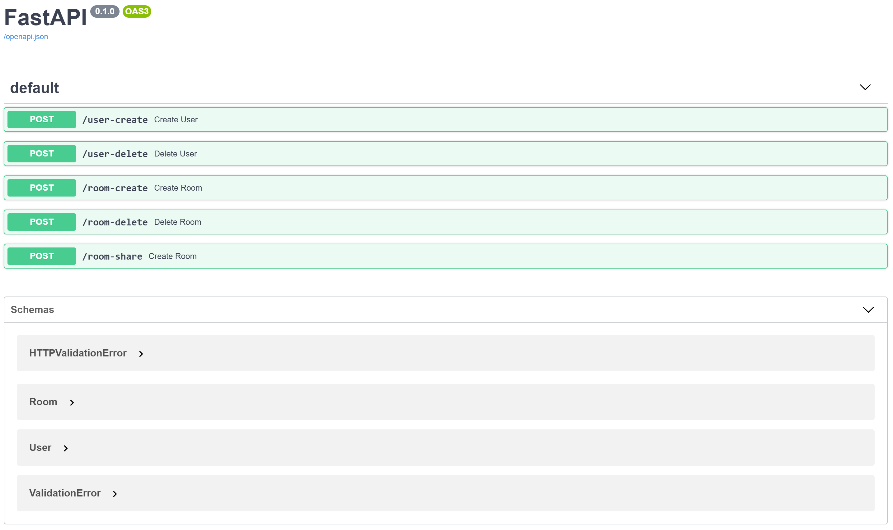

# greenLightAdapter

A tool to manually or automatically manage rooms and users in BigBlueButton and Greenlight via rest api.
You can manage multiple users, rooms and sharing of rooms.


The application mainly features one mode:

* daemon mode (running in the background and watching for changes and events to execute)

## Installation Guide
*  Clone the repository to /user/local/bin:
`git clone https://github.com/coderDem/greenLightAdapter.git /usr/local/bin/greenLightAdapter`

* Install the required python packages (you can use the shell script for ubuntu if you want)
    * Using a shell script:  
    `/usr/local/bin/greenLightAdapter/python_packages_setup.sh`

    * Or manually:
        ```
        apt -y install python3-pip
        apt -y install python3-psycopg2
        pip3 install -r /usr/local/bin/greenLightAdapter/python_packages.txt
        ```

* Install the systemd startup scripts:
`/usr/local/bin/greenLightAdapter/systemd/install.sh`


## Usage
* Start the processors:

    `systemctl start greenLightAdapter`

* Stop the processors

    `systemctl stop greenLightAdapter.target`

## Getting started
to understand how greenLightAdapter works and to have a first impression, please keep the following facts in mind and follow these steps:

* you need at least one BigBlueButton server and Greelnlight configured via api or config file.

## Docs
A documentation of the API can be found under http://localhost:8007/docs. With the help of the swagger-client you can directly test the endpoints.



## TODO

* secure the api
